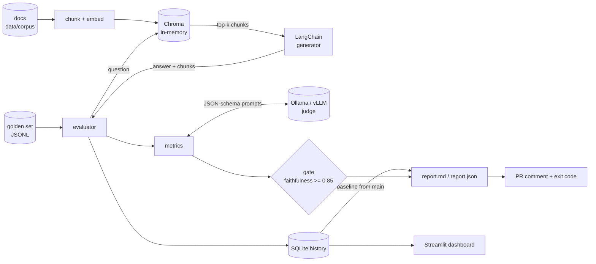

# rag-sentinel-eval

A CI gate for RAG pipelines. On every pull request it runs a set of known questions through
your retrieval + generation pipeline, has a local open-source LLM grade the answers, saves the
scores to SQLite, and fails the build if faithfulness drops below 0.85.

The judge runs on Ollama or any OpenAI-compatible server (vLLM, TGI, LM Studio), so your
documents and answers never leave your machines.

[](https://github.com/himalyansailor/rag-sentinel-eval/actions/workflows/rag-ci.yml)

## What it measures

Four metrics, following the definitions in the [RAGAS paper](https://arxiv.org/abs/2309.15217).
They're implemented here directly rather than through the `ragas` package, mainly so the judge
prompts could be tuned for small models (more on that below).

| Metric | Question it answers | Needs a reference answer |
|---|---|---|
| Faithfulness | Is every claim in the answer backed by the retrieved text? | no |
| Answer relevance | Does the answer address the question that was asked? | no |
| Context precision | Are the useful chunks ranked near the top? | optional |
| Context recall | Did retrieval find everything the reference answer needs? | yes |

Scores run from 0 to 1. Each score keeps its evidence, so when faithfulness is 0.5 you can see
which statement the judge rejected and why.

## How it fits together



The bundled pipeline (LangChain, in-memory ChromaDB, a small fictional company's policy docs)
is only there so the project works on its own. To test your real system, implement one method
and pass it to the evaluator; see [Using your own pipeline](#using-your-own-pipeline).

Design notes live in [docs/HLD.md](docs/HLD.md) (architecture and trade-offs) and
[docs/LLD.md](docs/LLD.md) (module contracts, metric algorithms, DB schema, exit codes).

## Running it locally

You need Python 3.11+, [Poetry](https://python-poetry.org/) and [Ollama](https://ollama.com/).

```bash
git clone https://github.com/himalyansailor/rag-sentinel-eval.git
cd rag-sentinel-eval
poetry install

ollama pull qwen2.5:3b         # judge
ollama pull llama3.2:3b        # generator for the bundled pipeline
ollama pull nomic-embed-text   # embeddings

cp .env.example .env           # optional, defaults match the models above
poetry run rag-sentinel evaluate --output-markdown reports/summary.md
echo $?                        # 0 passed, 1 gate failed
```

Then look at the results:

```bash
poetry run rag-sentinel history
poetry run rag-sentinel dashboard    # http://localhost:8501
```

On an 8 GB MacBook with the 3B models above, the 10-question golden set takes 4 to 6 minutes.
If you just want to click around the dashboard first, `rag-sentinel seed-demo` fills the history
with fake runs (stored under a separate `demo` dataset).

There's also a `docker-compose.yml` that runs Ollama and the dashboard together; the comments
at the top of that file list the commands.

### Commands

- `rag-sentinel evaluate` runs the golden set, scores it, saves the run and sets the exit code.
  Useful flags: `-t faithfulness=0.9` to change or add a threshold, `-m faithfulness` to compute
  only some metrics, `--limit 3` for a quick run, `--report-only` to never fail.
- `rag-sentinel history` prints recent runs.
- `rag-sentinel dashboard` opens the Streamlit app.
- `rag-sentinel seed-demo` adds fake history for trying out the UI.

Exit codes: `0` gate passed, `1` gate failed, `2` bad config or dataset (or the model isn't
pulled), `3` the judge or pipeline couldn't run.

## The GitHub Actions workflow

`.github/workflows/rag-ci.yml` has two jobs. The first runs ruff, mypy and the unit tests,
which need no model server. The second installs Ollama on the runner, pulls the models (cached
between runs), evaluates the golden set and posts the scorecard as a PR comment. The comment
shows how each score moved against the latest run on `main`. The job fails when faithfulness
is under 0.85, or when too many samples couldn't be scored at all. That second condition means
a crashed judge fails the build instead of slipping through as a pass.

A comment looks roughly like this:

```text
RAG Sentinel: quality gate failed ❌

| Metric            | Score | Δ vs baseline | Threshold | Status |
| Faithfulness      | 0.812 |      ▼ -0.071 |    ≥ 0.85 |   ❌   |
| Context recall    | 0.850 |      ▼ -0.050 |         — |  n/a   |
...
- faithfulness 0.812 is below the threshold 0.85
```

To gate on more than faithfulness, add flags in the workflow (`-t context_recall=0.75`) or set
`SENTINEL_GATE__THRESHOLDS='{"faithfulness": 0.9, "context_recall": 0.75}'`.

## A warning about small judges

The CI defaults are 3B models because that's what fits on a free GitHub runner and on an 8 GB
laptop. They work, but only after a fair amount of prompt tuning, and they still have blind
spots. On the bundled golden set:

- The first version of the prompts scored context recall at 0.15 even though retrieval was
  fine. The judge would quote the exact supporting sentence and then answer "not supported".
  Asking a plain yes/no question with a worked example fixed most of it.
- Labels matter. With `0`/`1` verdicts the judge agreed with its own reasoning on 4 of 14
  statements; with `"yes"`/`"no"` it was 12 of 14.
- Judging all retrieved chunks in one prompt made it attach verdicts to the wrong chunk.
  One chunk per call took context precision from 0.40 to 0.95 (39 of 40 chunks labelled
  correctly).
- It still misses changed numbers. An answer saying "60 days" where the docs say "14 days"
  passed faithfulness.

The full log is in [docs/LLD.md §6.5](docs/LLD.md#65-judge-calibration-log). If the gate
protects something important, point the judge at a 7B+ model on vLLM:

```bash
SENTINEL_JUDGE__PROVIDER=openai_compatible
SENTINEL_JUDGE__BASE_URL=http://your-vllm-host:8000
SENTINEL_JUDGE__MODEL=Qwen/Qwen2.5-32B-Instruct
```

Also use a different model for the judge than for the generator; models tend to go easy on
their own output.

## Using your own pipeline

The evaluator only needs an object with `aquery(question) -> RAGResponse` and `describe()`:

```python
from rag_sentinel.models import RAGResponse, RetrievedContext


class MyPipeline:
    async def aquery(self, question: str) -> RAGResponse:
        result = await my_app.answer(question)
        return RAGResponse(
            question=question,
            answer=result.text,
            contexts=[
                RetrievedContext(content=d.text, source=d.uri, rank=i)
                for i, d in enumerate(result.documents, start=1)
            ],
            latency_ms=result.latency_ms,
        )

    def describe(self) -> str:
        return "my-rag-app"
```

Then build the judge and metrics and run `Evaluator(MyPipeline(), metrics).run(samples, ...)`.
`_run_evaluation` in `src/rag_sentinel/cli.py` shows the whole wiring in about 30 lines.

## Golden set format

One JSON object per line, `//` comments allowed:

```json
{"id": "refund-monthly-window", "question": "How long do monthly plan customers have to request a full refund?", "ground_truth": "Customers on monthly plans can request a full refund within 14 days of their first payment."}
```

Keep the ids stable. They link the same question across runs in the history database.

## Configuration

All settings come from `SENTINEL_*` environment variables or a `.env` file. `.env.example`
lists the common ones and LLD §3 has the full table. The main ones:

| Variable | Default |
|---|---|
| `SENTINEL_JUDGE__PROVIDER` | `ollama` (or `openai_compatible`) |
| `SENTINEL_JUDGE__MODEL` | `qwen2.5:3b` |
| `SENTINEL_JUDGE__BASE_URL` | `http://localhost:11434` |
| `SENTINEL_PIPELINE__GENERATOR_MODEL` | `llama3.2:3b` |
| `SENTINEL_GATE__THRESHOLDS` | `{"faithfulness": 0.85}` |
| `SENTINEL_GATE__MAX_ERROR_RATE` | `0.2` |
| `SENTINEL_STORAGE__DB_PATH` | `.sentinel/history.db` |

## Contributing

```bash
poetry install
make check    # ruff, mypy --strict, pytest (coverage must stay above 85%)
```

The unit tests don't touch the network or a model. Judges are scripted fakes, HTTP is mocked
with `respx`, and the pipeline tests use real Chroma with hash-based embeddings. If you change
a judge prompt, test it against a real model too and add the result to the calibration log in
LLD §6.5; the unit tests can't tell you whether a 3B model understands the prompt. If a change
alters behaviour or an interface, update the design docs in the same PR.

## License

Apache 2.0
