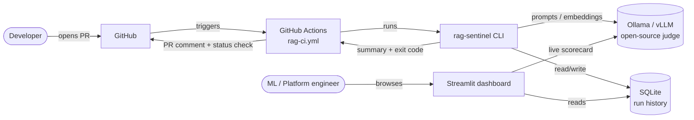
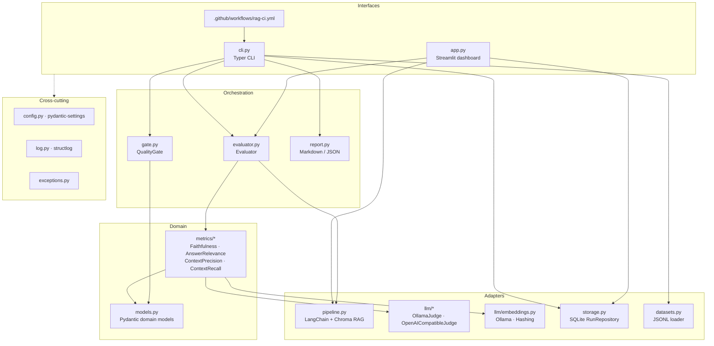
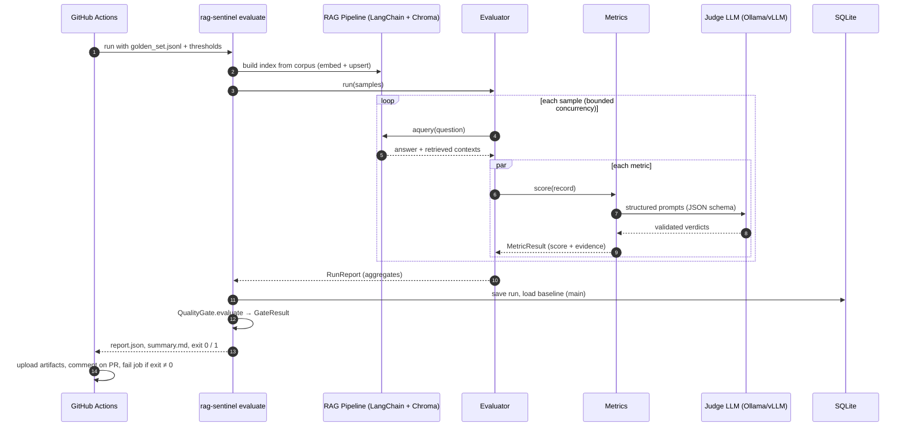

# High-level design

How rag-sentinel-eval is put together and why. Module-level detail is in [LLD.md](LLD.md).

## 1. Problem statement

Teams ship Retrieval-Augmented Generation (RAG) systems the same way they ship ordinary code:
a pull request changes a prompt, a chunk size, an embedding model or a retriever setting, unit
tests pass, and the change merges. None of those tests tell you whether the system still
answers from its sources or has started to hallucinate.

`rag-sentinel-eval` treats RAG quality as a build artifact. Every pull request runs a golden
dataset through the RAG pipeline, grades the results with an open-source LLM judge (Ollama or
vLLM, so no data leaves your infrastructure), stores the results, and fails the build when a
quality gate is breached, e.g. `faithfulness < 0.85`.

## 2. Goals and non-goals

### Goals

| # | Goal |
|---|------|
| G1 | Compute the four RAGAS-style metrics: Faithfulness, Answer Relevance, Context Precision, Context Recall. |
| G2 | Use a self-hosted judge (Ollama / any OpenAI-compatible server such as vLLM). No SaaS dependency. |
| G3 | Act as a CI quality gate: deterministic exit codes, machine-readable and PR-friendly reports. |
| G4 | Keep run history so regressions are visible over time. |
| G5 | Provide a dashboard for trends, run drill-down and ad-hoc "score this query" checks. |
| G6 | Be modular: new metrics, judges, pipelines and storage back-ends plug in behind small interfaces. |
| G7 | Be testable offline: the full unit suite runs with no model server and no network. |

### Non-goals (v0.1)

- Being a RAG framework. The bundled pipeline is a *reference system under test*; the evaluator
  targets any object that satisfies the `RAGPipeline` protocol.
- Multi-tenant hosting, authN/authZ for the dashboard. It is a local/internal tool.
- Synthetic golden-set generation (roadmap).
- Wrapping the `ragas` library itself. We implement the published metric *definitions* natively
  (see [ADR-1](#9-key-decisions-adrs)).

## 3. System context

## 4. Architecture overview

The system has five layers. Dependencies only point downward.

### 4.1 Components

| Component | Responsibility | Key interface |
|-----------|----------------|---------------|
| Pipeline (`pipeline.py`) | Reference RAG system: loads a markdown corpus, chunks it, indexes into an in-memory ChromaDB, retrieves top-k, generates an answer with LangChain (LCEL). | `RAGPipeline.aquery(question) -> RAGResponse` |
| Judge (`llm/`) | Sends prompts to an open-source LLM and returns schema-validated JSON (Pydantic). Owns retries, timeouts and error mapping. | `JudgeLLM.generate(prompt, schema) -> T` |
| Embeddings (`llm/embeddings.py`) | Vectors for retrieval and for Answer Relevance similarity. Hashing embedder allows fully offline runs. | LangChain `Embeddings` |
| Metrics (`metrics/`) | One class per metric. Each turns an `EvalRecord` into a `MetricResult` with a score in `[0,1]` and item-level evidence. | `Metric.score(record) -> MetricResult` |
| Evaluator (`evaluator.py`) | Runs samples through the pipeline and metrics with bounded concurrency; isolates per-sample/per-metric failures; aggregates. | `Evaluator.run(samples) -> RunReport` |
| Quality gate (`gate.py`) | Compares aggregates with thresholds and error budget; produces a verdict. | `QualityGate.evaluate(report) -> GateResult` |
| Storage (`storage.py`) | Persists runs, per-metric aggregates and per-sample results in SQLite; queries history and baselines. | `RunRepository` |
| Reporting (`report.py`) | Renders JSON and GitHub-flavoured Markdown (PR comment / job summary), including deltas vs. baseline. | `render_markdown(report, gate, baseline)` |
| CLI (`cli.py`) | `evaluate`, `history`, `seed-demo`. Exit code is the CI contract. | `rag-sentinel …` |
| Dashboard (`app.py`) | Regression charts over history, run drill-down, live faithfulness scorecard for a typed query. | Streamlit |

## 5. Data flow

### 5.1 CI evaluation (primary flow)

### 5.2 Dashboard flows

1. History: `app.py` → `RunRepository.list_runs()` / `metric_history()` → Altair line chart per
   metric with the threshold drawn as a rule; click-through to per-sample results.
2. Live scorecard: the user types a query (optionally a reference answer) → pipeline answers →
   `Faithfulness` (and optionally the other metrics) is computed → statement-level verdicts are shown.

## 6. Metric definitions (summary)

All scores are in `[0, 1]`, higher is better. The LLD has the exact algorithms and prompts.

| Metric | Question it answers | Needs ground truth | Formula (sketch) |
|--------|--------------------|--------------------|------------------|
| Faithfulness | Is every claim in the answer supported by the retrieved context? | No | `supported_statements / total_statements` |
| Answer Relevance | Does the answer address the question? | No | mean cosine(question, questions regenerated from answer), 0 if non-committal |
| Context Precision | Are the relevant chunks ranked at the top? | Optional (falls back to answer) | Average precision over ranked chunk-relevance verdicts |
| Context Recall | Did retrieval surface everything needed for the reference answer? | Yes | `attributable_reference_sentences / total_reference_sentences` |

## 7. Quality attributes

| Attribute | How it is achieved |
|-----------|--------------------|
| Reliability | Judge output is constrained with a JSON schema *and* validated with Pydantic; invalid output is retried with exponential backoff (`tenacity`). A failing metric yields `score=None` + error instead of crashing the run. An error budget (`max_error_rate`) makes the gate fail if too many samples could not be scored, so infrastructure failure never looks like a pass. |
| Determinism | Judge temperature `0`, fixed seed where the backend supports it, schema-constrained decoding, stable ordering of samples and contexts. |
| Observability | `structlog` everywhere; JSON logs in CI, pretty console locally; `run_id` and `sample_id` bound via context variables so every line is traceable. |
| Security / privacy | Self-hosted judge; secrets only via env (`SecretStr`); SQLite written with parameterised queries only; CI uses least-privilege `permissions`. |
| Performance | `asyncio` with a semaphore (`max_concurrency`); metrics for a sample run concurrently; batched verdicts for statements and sentences; context precision judges chunks one per call (concurrently) because batching long chunks misaligned small-model verdicts. |
| Extensibility | Protocols for `RAGPipeline` and `JudgeLLM`; `Metric` ABC + registry; storage behind a repository class. |
| Testability | Offline fakes (`HashingEmbeddings`, extractive generator, scripted judge). HTTP mocked with `respx`. |

## 8. Deployment views

| Environment | Judge | Storage | Notes |
|-------------|-------|---------|-------|
| Laptop | `ollama serve` + `qwen2.5:3b` judge, `llama3.2:3b` generator | `.sentinel/history.db` | `rag-sentinel evaluate`, `streamlit run`. |
| GitHub Actions | Ollama installed on the runner, small model (e.g. `qwen2.5:3b`), models cached | SQLite restored/saved with `actions/cache` for trend continuity; uploaded as artifact | Gate fails the job on breach. |
| Self-hosted GPU runner | vLLM (`openai_compatible` provider) with a 7–70B model | Same | Recommended for production-grade judging. |
| Docker Compose | `ollama` service | Volume | `docker compose up` for the dashboard. |

## 9. Key decisions (ADRs)

| ID | Decision | Rationale | Trade-off |
|----|----------|-----------|-----------|
| ADR-1 | Implement RAGAS metric *definitions* natively instead of depending on the `ragas` package. | `ragas`' API changes often and pulls heavy dependencies. Native code gives us schema-constrained prompts tuned for small open models, typed item-level evidence, and full control over retries. | We must track metric-definition changes ourselves. Scores are comparable in spirit, not bit-for-bit, to `ragas`. |
| ADR-2 | Custom `httpx` judge client instead of LangChain chat models for judging. | The judge is the core of the product: we need explicit timeouts, error taxonomy and JSON-schema decoding for both Ollama and vLLM. | Slightly more code. The *pipeline* still uses LangChain, which is what users build with. |
| ADR-3 | SQLite for history. | Zero-ops, file-based, trivially cached/uploaded in CI, readable by the dashboard. | Not for concurrent multi-writer use; the repository interface allows a Postgres implementation later. |
| ADR-4 | Long-format `run_metrics` table instead of one column per metric. | New metrics need no migration. | Dashboard pivots in pandas. |
| ADR-5 | Gate on aggregate mean plus an error budget. | Mean matches how RAGAS reports; the error budget stops "judge was down" from passing. | A single catastrophic sample can hide in the mean; per-sample floors are on the roadmap. |
| ADR-6 | `None` (not `0`) for non-applicable/failed scores; excluded from means. | A missing ground truth is not a bad answer. | Consumers must handle `None`; reports show counts. |

## 10. Risks

| Risk | Mitigation |
|------|------------|
| Small CPU models are noisy judges. | Temperature 0, schema-constrained output, batched verdicts, word labels and worked examples (see the calibration log, LLD §6.5), larger model on vLLM in production. Measured: a 3B judge rejects most fabricated claims but can miss changed numbers. |
| Same model as generator and judge (self-preference bias). | Configure different models for `pipeline.generator_model` and `judge.model`. |
| CI time and cost. | Small golden set on PRs (~10 samples), `--metrics` selection, model cache. Nightly full run on the roadmap. |
| History lost between CI runs. | `actions/cache` restore-keys accumulate the DB; artifacts keep every run's DB. |

## 11. Roadmap

- Per-sample minimum thresholds and "max regression vs. baseline" gates.
- Nightly full-dataset workflow and trend alerts.
- Postgres `RunRepository`.
- Synthetic golden-set generation from the corpus.
- Additional metrics (answer correctness, context entity recall, toxicity).
