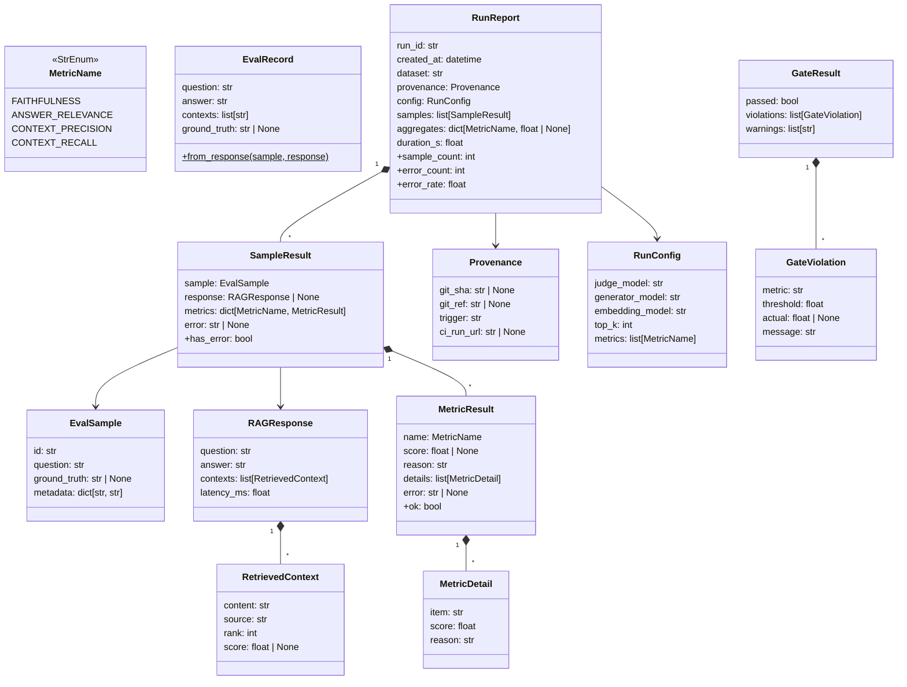
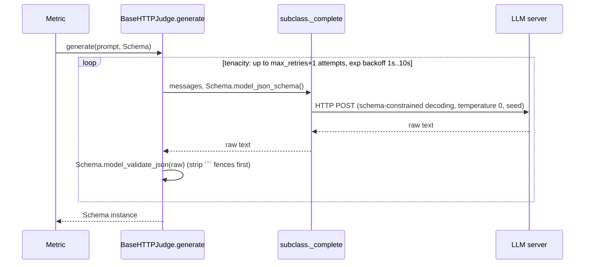
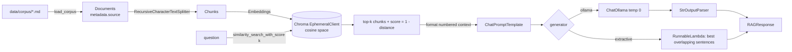
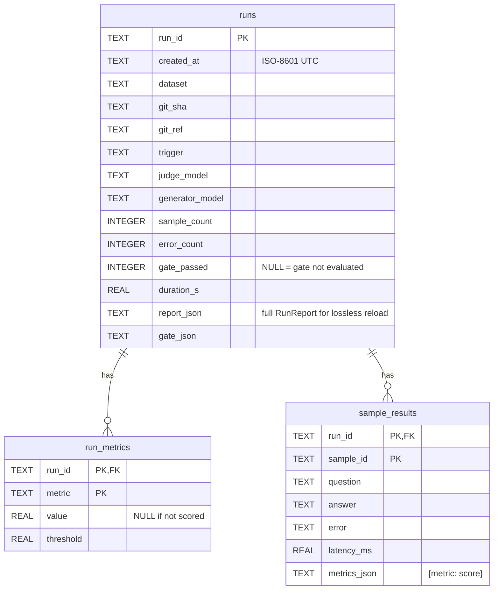

# Low-level design

The implementation contract for each module in `src/rag_sentinel/`. For the big picture, read [HLD.md](HLD.md) first.

## 1. Package layout

```text
src/rag_sentinel/
├── __init__.py          # version, public re-exports
├── config.py            # Settings (pydantic-settings), nested per concern
├── log.py               # structlog configuration
├── exceptions.py        # error taxonomy
├── models.py            # Pydantic domain models (pure data, no I/O)
├── protocols.py         # JudgeLLM and RAGPipeline protocols
├── provenance.py        # git / CI metadata detection
├── datasets.py          # golden-set loader (JSONL / JSON)
├── llm/
│   ├── base.py          # BaseHTTPJudge: retries, JSON-schema decoding, error mapping
│   ├── ollama.py        # OllamaJudge          (POST /api/chat)
│   ├── openai_compat.py # OpenAICompatibleJudge (POST /v1/chat/completions, vLLM)
│   ├── embeddings.py    # HashingEmbeddings + build_embeddings()
│   └── factory.py       # build_judge()
├── metrics/
│   ├── base.py          # Metric ABC (template method), verdict helper
│   ├── schemas.py       # Pydantic schemas the judge must return
│   ├── prompts.py       # prompt builders (pure functions)
│   ├── text.py          # sentence split, cosine, average precision
│   ├── faithfulness.py
│   ├── answer_relevance.py
│   ├── context_precision.py
│   ├── context_recall.py
│   └── __init__.py      # registry + build_metrics()
├── pipeline.py          # LangChain + in-memory ChromaDB reference RAG pipeline
├── evaluator.py         # Evaluator: concurrency, isolation, aggregation
├── gate.py              # QualityGate
├── storage.py           # SQLite RunRepository + migrations
├── report.py            # JSON + Markdown rendering
├── cli.py               # Typer CLI (entry point `rag-sentinel`)
└── app.py               # Streamlit dashboard
```

Dependency rule: `models`, `exceptions`, `protocols` import nothing from the package except each
other. `metrics` never import `pipeline`, `storage` or `cli`. Only `cli` and `app` wire concrete
classes together (composition root).

## 2. Domain model (`models.py`)



Rules:

- `score` is `None` when a metric is not applicable (e.g. no ground truth → `reason` explains)
  or failed (`error` is set). `MetricResult.ok == (error is None)`.
- `SampleResult.has_error` is true if the pipeline failed or any metric has `error`. Skipped
  metrics are *not* errors.
- `RunReport.aggregates[m]` = arithmetic mean of non-`None` scores for `m`; `None` if no sample
  produced a score. Aggregates are stored (not derived) so historical/seeded runs round-trip.
- `error_rate = error_count / sample_count` (`0.0` for an empty run).

## 3. Configuration (`config.py`)

`Settings(BaseSettings)` with `env_prefix="SENTINEL_"`, `env_nested_delimiter="__"`, `.env`
support. Accessed through `get_settings()` (cached). Nothing else reads environment variables,
except `provenance.py` which reads CI variables.

| Group | Field | Default | Env var |
|-------|-------|---------|---------|
| — | `log_level` | `INFO` | `SENTINEL_LOG_LEVEL` |
| — | `log_json` | `false` | `SENTINEL_LOG_JSON` |
| `judge` | `provider` | `ollama` (`ollama` \| `openai_compatible`) | `SENTINEL_JUDGE__PROVIDER` |
| | `base_url` | `http://localhost:11434` | `SENTINEL_JUDGE__BASE_URL` |
| | `model` | `qwen2.5:3b` | `SENTINEL_JUDGE__MODEL` |
| | `api_key` | `None` (`SecretStr`) | `SENTINEL_JUDGE__API_KEY` |
| | `timeout_s` | `120` | `SENTINEL_JUDGE__TIMEOUT_S` |
| | `max_retries` | `3` | `SENTINEL_JUDGE__MAX_RETRIES` |
| | `temperature` | `0.0` | `SENTINEL_JUDGE__TEMPERATURE` |
| | `seed` | `42` | `SENTINEL_JUDGE__SEED` |
| `embeddings` | `provider` | `ollama` (`ollama` \| `hashing`) | `SENTINEL_EMBEDDINGS__PROVIDER` |
| | `model` | `nomic-embed-text` | `SENTINEL_EMBEDDINGS__MODEL` |
| | `base_url` | `http://localhost:11434` | `SENTINEL_EMBEDDINGS__BASE_URL` |
| `pipeline` | `corpus_dir` | `data/corpus` | `SENTINEL_PIPELINE__CORPUS_DIR` |
| | `collection_name` | `sentinel` | `SENTINEL_PIPELINE__COLLECTION_NAME` |
| | `chunk_size` / `chunk_overlap` | `800` / `120` | … |
| | `top_k` | `4` | `SENTINEL_PIPELINE__TOP_K` |
| | `generator` | `ollama` (`ollama` \| `extractive`) | `SENTINEL_PIPELINE__GENERATOR` |
| | `generator_model` | `llama3.2:3b` | `SENTINEL_PIPELINE__GENERATOR_MODEL` |
| | `base_url` | `http://localhost:11434` | `SENTINEL_PIPELINE__BASE_URL` |
| `evaluation` | `max_concurrency` | `4` | `SENTINEL_EVALUATION__MAX_CONCURRENCY` |
| | `answer_relevance_questions` | `3` | … |
| `gate` | `thresholds` | `{"faithfulness": 0.85}` | `SENTINEL_GATE__THRESHOLDS` (JSON) |
| | `warn_thresholds` | `{"answer_relevance": 0.7, "context_precision": 0.7, "context_recall": 0.7}` | `SENTINEL_GATE__WARN_THRESHOLDS` |
| | `max_error_rate` | `0.2` | `SENTINEL_GATE__MAX_ERROR_RATE` |
| `storage` | `db_path` | `.sentinel/history.db` | `SENTINEL_STORAGE__DB_PATH` |

Validation: thresholds keys must be valid `MetricName` values and values in `[0, 1]`;
`chunk_overlap < chunk_size`; `top_k ≥ 1`; `max_concurrency ≥ 1`.

## 4. Error taxonomy (`exceptions.py`)

```text
SentinelError                         base; every raised error in the package derives from it
├── ConfigurationError                invalid settings / CLI arguments            → exit 2
├── DatasetError                      unreadable / invalid golden set            → exit 2
├── PipelineError                     corpus load, indexing, retrieval, generation → exit 3 (build) / per-sample (query)
├── StorageError                      SQLite failure                             → exit 3
└── JudgeError                        any judge failure
    ├── JudgeUnavailableError         connect error, timeout, 5xx/429 after retries → exit 3
    ├── JudgeConfigurationError       4xx e.g. model not pulled / auth            → exit 2
    └── JudgeResponseError            output not valid JSON / fails schema / wrong item count
```

Handling matrix:

| Where | Error | Behaviour |
|-------|-------|-----------|
| `BaseHTTPJudge.generate` | transport error, 5xx, 429, `JudgeResponseError` | retried (`tenacity`, exp. backoff, `max_retries`) then re-raised |
| `BaseHTTPJudge.generate` | other 4xx | raised immediately as `JudgeConfigurationError` |
| `Metric.score` | any exception | caught, logged with `exc_info`, returned as `MetricResult(score=None, error=…)` |
| `Evaluator.evaluate_sample` | `PipelineError` / any exception from pipeline | caught → `SampleResult(error=…, metrics={})` |
| `QualityGate` | `error_rate > max_error_rate` | violation → gate fails (infra failures can't pass silently) |
| `cli.evaluate` | `SentinelError` subclasses | logged, mapped to exit codes (§12) |

## 5. Judge layer (`protocols.py`, `llm/`)

```python
class JudgeLLM(Protocol):
    @property
    def model_name(self) -> str: ...
    async def generate(self, prompt: str, schema: type[T], *, system: str | None = None) -> T: ...
    async def healthcheck(self) -> None: ...     # raises JudgeError subclasses
    async def aclose(self) -> None: ...
```

`BaseHTTPJudge` (abstract) implements `generate` once:



| Provider | Endpoint | Structured output | Health check |
|----------|----------|-------------------|--------------|
| `OllamaJudge` | `POST {base}/api/chat` `{"model","messages","stream":false,"format":<json schema>,"options":{"temperature","seed"}}` → `message.content` | `format` = JSON schema | `GET /api/tags`, model must be listed (else `JudgeConfigurationError` with `ollama pull` hint) |
| `OpenAICompatibleJudge` | `POST {base}/v1/chat/completions` with `response_format={"type":"json_schema",…}`, optional `Authorization: Bearer` → `choices[0].message.content` | `response_format` | `GET /v1/models` |

HTTP status mapping: `429` and `≥500` → `JudgeUnavailableError` (retryable); other `4xx` →
`JudgeConfigurationError` (not retried); `httpx.TransportError`/timeouts → `JudgeUnavailableError`.

The judge owns one `httpx.AsyncClient`; it is an async context manager. Clients are bound to an
event loop, so callers must use a judge within a single loop (the dashboard keeps one background
loop for this reason, see §11).

Embeddings use LangChain's `Embeddings` interface so the pipeline and the Answer Relevance
metric share one abstraction. `HashingEmbeddings` (feature hashing of unigrams+bigrams, signed,
L2-normalised, `dim=384`) is deterministic and dependency-free for tests and offline demos.

## 6. Metrics (`metrics/`)

### 6.1 Base class

```python
class Metric(ABC):
    name: ClassVar[MetricName]
    requires_ground_truth: ClassVar[bool] = False

    async def score(self, record: EvalRecord) -> MetricResult:   # template method, never raises
        if self.requires_ground_truth and not record.ground_truth:
            return MetricResult(name=self.name, score=None, reason="skipped: no ground truth")
        try:
            return await self._score(record)
        except Exception as exc:                                    # isolation boundary
            log.exception(...); return MetricResult(name=self.name, score=None, error=str(exc))

    @abstractmethod
    async def _score(self, record: EvalRecord) -> MetricResult: ...
```

`judge_verdicts(judge, prompt, schema, expected)` asks for a list of verdicts and checks the
count equals `expected`; on mismatch it re-asks (up to 2 extra attempts) and then raises
`JudgeResponseError`. Faithfulness and Context Recall use one batched judge call per step
(all statements / sentences in one prompt). Context Precision is the exception: it judges
one chunk per call, concurrently, because batching long chunks made small judges attach
verdicts to the wrong chunk (§6.5).

Registry: `METRIC_REGISTRY: dict[MetricName, type[Metric]]`;
`build_metrics(names, judge, embeddings, settings) -> list[Metric]`.

### 6.2 Algorithms

Faithfulness (`requires_ground_truth=False`)

1. `statements = judge(extract_statements(question, answer)) -> StatementList`
   (atomic, self-contained claims; pronouns resolved).
2. If `statements == []` → `score=None`, reason "no verifiable statements".
3. `verdicts = judge_verdicts(nli(contexts, statements))`, each `{reason, verdict ∈ {0,1}}`.
4. `score = Σ verdict / |statements|`. `details = [(statement, verdict, reason)]`.

Answer Relevance (`requires_ground_truth=False`)

1. `g = judge(generate_questions(answer, n)) -> {questions: list[str], noncommittal: bool}`.
2. If `noncommittal` → `score=0.0` (evasive answers are not relevant).
3. `E = embeddings.aembed_documents([question, *g.questions])`.
4. `score = clip(mean_i cos(E[0], E[i]), 0, 1)`. `details = [(generated_q, cos)]`.

Context Precision (reference is `ground_truth` if present, else `answer`; noted in `reason`)

1. No contexts → `score=None`.
2. `v_k = judge(chunk_usefulness(question, reference, chunk_k)) -> Verdict` for every chunk,
   run concurrently (1 if chunk *k* states a fact used in the reference).
3. Average precision: `score = Σ_k (precision@k · v_k) / Σ_k v_k`, with `precision@k = Σ_{i≤k} v_i / k`;
   `0.0` if `Σ v_k = 0`.

Context Recall (`requires_ground_truth=True`)

1. `sentences = split_sentences(ground_truth)`.
2. No contexts → `score=0.0` (nothing could be attributed).
3. `v_i = judge_verdicts(attribution(question, contexts, sentences))`.
4. `score = Σ v_i / |sentences|`.

### 6.3 Judge output schemas (`metrics/schemas.py`)

```python
class StatementList(BaseModel):   statements: list[str]
class Verdict(BaseModel):         reason: str; verdict: Literal["yes", "no"]   # .value -> 1 / 0
class VerdictList(BaseModel):     verdicts: list[Verdict]
class GeneratedQuestions(BaseModel): questions: list[str]; noncommittal: bool
```

Prompts (`metrics/prompts.py`) are pure functions returning strings. Every verdict prompt:

- asks one plain question ("Does the CONTEXT contain this information?"), not an abstract task
  such as "can it be attributed";
- includes one worked example (unrelated domain, no `(N total)` marker so it cannot be confused
  with the real items);
- numbers every item (`[1] …`) and states the exact count expected;
- asks for the `reason` before the `verdict`, and uses word labels (`"yes"`/`"no"`).

Faithfulness also drops extracted "statements" with no word characters (e.g. `"..."`).

### 6.4 Adding a metric

1. Add a value to `MetricName`.
2. Subclass `Metric`, implement `_score`, set `name` / `requires_ground_truth`.
3. Register it in `METRIC_REGISTRY` and, if it needs extra dependencies, in `build_metrics`.
4. Add unit tests with `ScriptedJudge` (see `tests/conftest.py`).
No storage migration is needed (ADR-4).

### 6.5 Judge calibration log

Prompt changes must be validated on real model output, not only with unit fakes. Record the
evidence here.

| Date | Judge | Change | Evidence |
|------|-------|--------|----------|
| 2026-09-28 | `qwen2.5:3b` | Abstract "attributed to" wording → plain yes/no question + worked example | Given only the chunk containing the answer verbatim, the old prompt quoted the fact and still returned "not supported". |
| 2026-09-28 | `qwen2.5:3b` | Verdict labels `0/1` → `"yes"/"no"` | Same prompts, 14 real answer statements: correctly supported 4/14 with digits vs 12/14 with words. The model often wrote "the context states X" and then emitted `0`. |
| 2026-09-28 | `qwen2.5:3b` | Negative control after both changes | Real answers 5/5 scored 1.0; fabricated answers 4/5 scored 0.0. Miss: a changed number ("60 days" vs "14 days") was accepted. Small judges are weak on numeric substitutions; use a ≥7B judge for gating in production. |
| 2026-09-28 | `qwen2.5:3b` | Context precision: all chunks in one call → one call per chunk | Gold labels from key-fact matching on 40 retrieved chunks: 31/40 correct batched vs 39/40 per chunk. All 9 batched misses were the *relevant* chunks (verdicts attached to the wrong chunk number). Judge time 58 s → 69 s for the set. |

## 7. Reference pipeline (`pipeline.py`)



- `LangChainRAGPipeline.from_settings(settings.pipeline, embeddings)` builds everything.
- Collection names get a random suffix: Chroma's `EphemeralClient` shares process-wide state, so
  two pipelines must never collide.
- Chunk ids are `sha256(source + chunk_index)` for deterministic upserts.
- `aquery` wraps any exception in `PipelineError`; latency is measured with `time.perf_counter`.
- The extractive generator returns the 2 sentences from retrieved chunks with the highest token
  overlap with the question. It is faithful by construction, so it is the offline baseline.
- Any object implementing `RAGPipeline` (`async aquery(question) -> RAGResponse`, `describe() -> str`)
  can replace it. That is how you evaluate your own production RAG.

## 8. Evaluator (`evaluator.py`)

```python
class Evaluator:
    def __init__(self, pipeline: RAGPipeline, metrics: Sequence[Metric], *, max_concurrency: int = 4)
    async def score_record(self, record: EvalRecord) -> dict[MetricName, MetricResult]
    async def evaluate_sample(self, sample: EvalSample) -> SampleResult
    async def run(self, samples, *, dataset, provenance, config, on_progress=None) -> RunReport
```

- `run` creates a `run_id` (`uuid4().hex[:12]`), binds it with `structlog.contextvars`, and uses
  `asyncio.Semaphore(max_concurrency)` around `evaluate_sample`. Results keep input order
  (`asyncio.gather`).
- Within a sample, the metrics run concurrently (`asyncio.gather`); they only read the record.
- `evaluate_sample` never raises: pipeline failures become `SampleResult.error`.
- `aggregate(samples, metric_names)` is a pure function (unit-tested separately).
- Events logged: `run.started`, `sample.completed` (per-metric scores, latency), `sample.failed`,
  `run.completed` (aggregates, error_rate, duration).

## 9. Quality gate (`gate.py`)

```python
@dataclass(frozen=True)
class QualityGate:
    thresholds: Mapping[MetricName, float]        # blocking: aggregate must be >= threshold
    warn_thresholds: Mapping[MetricName, float]   # non-blocking
    max_error_rate: float = 0.2
    def evaluate(self, report: RunReport) -> GateResult
```

Decision table (checks are independent; all violations are reported, not only the first):

| Condition | Result |
|-----------|--------|
| blocking metric not in `report.config.metrics` | violation "metric was not evaluated" (catches misconfiguration) |
| aggregate is `None` | violation "no sample produced a score" |
| aggregate `< threshold` | violation |
| `error_rate > max_error_rate` | violation "error budget exceeded" |
| warn metric below warn threshold | warning only |
| no violations | `passed=True` |

`parse_threshold_overrides(["faithfulness=0.9"])` parses CLI overrides and raises
`ConfigurationError` on bad names/values.

## 10. Storage (`storage.py`)



- Migrations: ordered list of SQL scripts; applied while `PRAGMA user_version < len(MIGRATIONS)`.
- Pragmas per connection: `foreign_keys=ON`, `journal_mode=WAL`, `busy_timeout=5000`.
- A new connection per operation (`contextlib.closing` + transaction), which is safe for Streamlit's
  threads. All SQL is parameterised. `sqlite3.Error` → `StorageError`.

API:

```python
class RunRepository:
    def __init__(self, db_path: Path) -> None                      # creates dirs, migrates
    def save_run(self, report: RunReport, gate: GateResult | None, thresholds: Mapping[str, float] = {}) -> None
    def get_run(self, run_id: str) -> RunReport | None
    def get_gate(self, run_id: str) -> GateResult | None
    def list_runs(self, *, dataset: str | None = None, git_ref: str | None = None, limit: int = 200) -> list[RunSummary]
    def metric_history(self, *, dataset: str | None = None, limit: int = 500) -> list[MetricPoint]
    def latest_run(self, *, dataset: str, git_ref: str | None, exclude_run_id: str | None = None) -> RunSummary | None
    def datasets(self) -> list[str]
```

`RunSummary` and `MetricPoint` are small frozen Pydantic models defined in `storage.py`.

## 11. Interfaces

### 11.1 CLI (`cli.py`)

```text
rag-sentinel evaluate  [--dataset PATH] [--corpus DIR] [--metric NAME]... [--threshold M=V]...
                       [--max-error-rate F] [--limit N] [--db PATH] [--no-save]
                       [--output-json PATH] [--output-markdown PATH] [--baseline-ref REF]
                       [--report-only]
rag-sentinel history   [--dataset NAME] [--limit N] [--db PATH]
rag-sentinel seed-demo [--runs N] [--db PATH]
rag-sentinel dashboard [--port N]
```

`evaluate` flow: settings → logging → dataset → judge (`healthcheck`) → embeddings → pipeline →
metrics → `Evaluator.run` → `QualityGate.evaluate` → baseline lookup → save → write reports →
exit code.

### 11.2 Exit codes (CI contract)

| Code | Meaning |
|------|---------|
| 0 | gate passed (or `--report-only`) |
| 1 | gate failed (quality regression) |
| 2 | configuration / dataset / judge configuration error |
| 3 | infrastructure error (judge unreachable, pipeline build, storage) |

### 11.3 Dashboard (`app.py`)

- Three tabs: Regression history, Run explorer, Live scorecard.
- `RunRepository` is read per interaction (cheap); pipeline, judge and embeddings are cached with
  `st.cache_resource` and driven through a single `BackgroundLoop` (daemon thread + persistent
  event loop) because async HTTP clients are loop-bound.
- History chart: Altair line+point per metric over `created_at`, tooltips with run id / ref / sha,
  horizontal rule for each blocking threshold.
- Live scorecard: query (+ optional reference answer) → pipeline → Faithfulness (always) and any
  selected extra metrics → score vs threshold, statement-level verdict table, retrieved chunks.

### 11.4 CI workflow (`.github/workflows/rag-ci.yml`)

| Job | Steps |
|-----|-------|
| `quality` | checkout → Poetry install (cached) → `ruff check` → `ruff format --check` → `mypy` → `pytest` (offline) |
| `rag-eval` (needs `quality`) | install Ollama → restore model cache (only `main` saves it; the models are ~4 GB) → `ollama pull` judge/generator/embedding models → restore history DB cache → `rag-sentinel evaluate` → append `summary.md` to job summary → sticky PR comment → upload artifacts → save history DB → fail job if exit code ≠ 0 |

The evaluate step records its exit code instead of failing immediately so that reports and
comments are always published; the final step enforces the gate.

## 12. Logging (`log.py`)

- `configure_logging(level, json_logs)`: processors `merge_contextvars → add_log_level →
  TimeStamper(iso, utc) → StackInfoRenderer → format_exc_info → JSONRenderer | ConsoleRenderer`.
- Logs go to stderr; stdout is reserved for CLI output.
- Noisy third-party loggers (`httpx`, `chromadb`, `urllib3`) are set to `WARNING`.
- Event names are `dot.separated` nouns-verbs (`judge.request.failed`); values are fields, never
  interpolated into the message.

## 13. Testing strategy

| Layer | Technique |
|-------|-----------|
| metrics | `ScriptedJudge` returns queued schema instances; assert scores & edge cases (empty statements, count mismatch, noncommittal, missing ground truth) |
| judge | `respx` mocks for Ollama/OpenAI endpoints: success, fenced JSON, invalid JSON retry, 404 no-retry, 503 retry exhaustion |
| pipeline | real Chroma + `HashingEmbeddings` + extractive generator on the bundled corpus |
| evaluator | end-to-end with the offline pipeline and scripted judge; failure isolation |
| gate / report / datasets / storage | pure unit tests; storage on `tmp_path` |

No test touches the network or a model server. Coverage target: ≥ 85 % lines.
